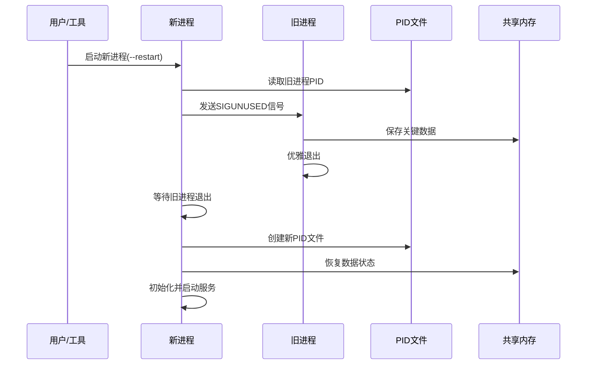

# NFShmXFrame 服务器热更重启详解

## 概述

NFShmXFrame服务器提供了强大的热更重启功能，允许在不影响服务的情况下进行代码更新和服务器重启。本文档详细介绍`--restart`参数的使用方法、实现原理、热更流程和各种重启场景。

## 一、热更重启触发方式

### 1.1 命令行触发

```bash
# 基本重启命令
./NFPluginLoader --Server=GameServer --ID=1.11.1.1 --Restart

# 带守护进程的重启
./NFPluginLoader --Server=GameServer --ID=1.11.1.1 --Restart --Daemon

# 多服务器模式重启
./NFPluginLoader --Server=AllMoreServer --ID=1.1.1.1 --Restart --Daemon
```

### 1.2 HTTP接口触发

```bash
# 重启指定服务器
curl "http://127.0.0.1:6011/restart?Server=GameServer&ID=1.11.1.1"

# 重启所有服务器
curl "http://127.0.0.1:6011/restartall"
```

### 1.3 ServerController工具触发

```bash
# 重启指定服务器
NFServerController restart 1.11.1.1

# 重启所有服务器
NFServerController restart

# 交互式监控模式重启
NFServerController monitor
> restart GameServer
```

### 1.4 信号触发（Linux）

```bash
# 发送热更信号（需要自定义信号处理）
kill -USR2 <服务器进程ID>

# 通过PID文件发送信号
kill -USR2 $(cat /tmp/NFGameServer1.11.1.1.pid)
```

## 二、热更重启实现原理

### 2.1 核心机制概述

NFShmXFrame的热更重启基于以下核心机制：
- **PID文件管理**：通过PID文件跟踪和管理服务器进程
- **信号通信**：使用Linux信号实现进程间通信
- **进程替换**：杀死旧进程并启动新进程
- **状态保持**：通过共享内存保持关键数据状态

### 2.2 重启流程架构



### 2.3 KillPreApp核心实现

```cpp
// Linux平台下的进程替换实现
int NFCPluginManager::KillPreApp()
{
    bool exist = false;
    // 检查PID文件是否存在
    exist = NFFileUtility::IsFileExist(m_strPidFileName);
    if (exist)
    {
        std::string content;
        // 读取旧进程的PID
        NFFileUtility::ReadFileContent(m_strPidFileName, content);
        
        // 转换为进程ID
        pid_t proc_id = NFCommon::strto<pid_t>(content);
        
        // 发送SIGUNUSED信号终止旧进程
        kill(proc_id, SIGUNUSED);
        
        // 等待旧进程退出，最多等待10秒
        return TimedWait(proc_id, 10);
    }
    
    return 0; // 没有旧进程，直接返回成功
}

// 定时等待进程退出
int NFCPluginManager::TimedWait(pid_t pid, int sec)
{
    int status = 0;
    int count = 0;
    
    while (count < sec * 10) // 每100ms检查一次
    {
        // 检查进程是否还存在
        if (kill(pid, 0) != 0)
        {
            return 0; // 进程已退出
        }
        
        usleep(100000); // 休眠100ms
        count++;
    }
    
    // 超时强制杀死
    kill(pid, SIGKILL);
    return -1;
}
```

### 2.4 信号处理机制

```cpp
void HandleSignal(int signo)
{
    switch (signo)
    {
        // 热更重启信号
        case SIGUNUSED:
            NFLogInfo(NF_LOG_DEFAULT, 0, "Received hotfix restart signal");
            NFGlobalSystem::Instance()->SetServerStopping(true);
            NFGlobalSystem::Instance()->SetServerKilling(true);
            break;
            
        // 优雅停服信号
        case SIGTERM:
        case SIGUSR1:
            NFLogInfo(NF_LOG_DEFAULT, 0, "Received graceful shutdown signal");
            NFGlobalSystem::Instance()->SetServerStopping(true);
            break;
            
        // 配置重载信号
        case SIGUSR2:
            NFGlobalSystem::Instance()->SetReloadServer(true);
            break;
    }
}
```

## 三、热更重启流程详解

### 3.1 命令行重启处理

```cpp
// 处理--restart参数
if (cmdParser.Exist("Restart"))
{
    // 1. 检查是否需要守护进程模式
    if (cmdParser.Exist("Daemon"))
    {
        pPluginManager->SetDaemon();
        InitDaemon(); // 初始化守护进程
    }
    
    // 2. 初始化信号处理
    InitSignal();
    
    // 3. 设置杀死前一个应用的标记
    pPluginManager->SetKillPreApp(true);
    
    // 4. 尝试杀死前一个应用程序
    if (pPluginManager->KillPreApp() < 0)
    {
        std::cout << "kill pre app failed!" << std::endl;
        exit(0);
    }
    
    // 5. 创建新的PID文件
    if (pPluginManager->CreatePidFile() < 0)
    {
        std::cout << "create pid file failed!" << std::endl;
        exit(0);
    }
    
    // 6. 继续正常的服务器启动流程
}
```

### 3.2 多服务器模式重启

```cpp
// AllMoreServer模式下的重启处理
if (strAppName == "AllMoreServer")
{
    NFGlobalSystem::Instance()->SetMoreServer(true);
    
    // 加载配置
    NFGlobalSystem::Instance()->LoadConfig(strPlugin);
    const NFrame::pbPluginConfig* pPlugConfig = 
        NFGlobalSystem::Instance()->GetAllMoreServerConfig();
    
    // 为每个服务器创建重启参数
    for (int i = 0; i < pPlugConfig->serverlist_size(); i++)
    {
        const NFrame::pbAllServerConfig& serverConfig = pPlugConfig->serverlist(i);
        
        std::vector<std::string> vecParam;
        vecParam.push_back(argv[0]);
        vecParam.push_back("--Server=" + serverConfig.server());
        vecParam.push_back("--ID=" + serverConfig.id());
        vecParam.push_back("--Config=" + strConfigPath);
        vecParam.push_back("--Plugin=" + strPlugin);
        vecParam.push_back("--restart"); // 每个子服务器都带重启标记
        
        // 创建插件管理器并处理重启
        NFIPluginManager* pPluginManager = NF_NEW NFCPluginManager();
        ProcessParameter(pPluginManager, vecParam);
        
        NFGlobalSystem::Instance()->AddPluginManager(pPluginManager);
    }
}
```

### 3.3 主循环热更检测

```cpp
// 主循环中的热更处理
while (true)
{
    // 执行插件管理器逻辑
    for (auto* pPluginManager : vecPluginManager)
    {
        pPluginManager->Execute();
    }
    
    // 热更处理
    if (NFGlobalSystem::Instance()->IsHotfixServer())
    {
        NFLogInfo(NF_LOG_DEFAULT, 0, "Main Hotfix Server................");
        
        for (auto* pPluginManager : vecPluginManager)
        {
            pPluginManager->SetHotfixServer(true);
            if (!pPluginManager->HotfixServer())
            {
                bExit = false; // 热更失败，继续等待
            }
        }
        
        if (bExit)
        {
            NFLogInfo(NF_LOG_DEFAULT, 0, "Main Hotfix Server Success................");
            break; // 热更成功，退出主循环
        }
    }
    
    // 正常停服处理
    if (NFGlobalSystem::Instance()->IsServerStopping())
    {
        // 执行停服逻辑...
    }
}
```

## 四、HTTP接口重启管理

### 4.1 MasterServer重启接口

```cpp
// 重启指定服务器
bool NFCMasterServerModule::HandleRestartServer(uint32_t, const NFIHttpHandle &req)
{
    std::string serverName = req.GetQuery("Server");
    std::string serverID = req.GetQuery("ID");
    
    if (serverID.empty() || serverName.empty())
    {
        return false;
    }
    
    // 向所有Monitor服务器发送重启请求
    std::vector<NF_SHARE_PTR<NFServerData>> vecServer = 
        FindModule<NFIMessageModule>()->GetAllServer(NF_ST_MASTER_SERVER);
        
    for(int i = 0; i < (int)vecServer.size(); i++)
    {
        NFServer::Proto_MasterTMonitorRestartReq reqMsg;
        reqMsg.set_server_name(serverName);
        reqMsg.set_server_id(serverID);
        
        FindModule<NFIMessageModule>()->Send(
            vecServer[i]->mUnlinkId, 
            NF_MODULE_FRAME, 
            NFrame::NF_MasterTMonitor_RESTART_CMD_REQ, 
            reqMsg, 
            req.GetRequestId()
        );
    }
    
    return true;
}

// 重启所有服务器
bool NFCMasterServerModule::HandleRestartAllServer(uint32_t, const NFIHttpHandle &req)
{
    std::vector<NF_SHARE_PTR<NFServerData>> vecServer = 
        FindModule<NFIMessageModule>()->GetAllServer(NF_ST_MASTER_SERVER);
        
    for(int i = 0; i < (int)vecServer.size(); i++)
    {
        NFServer::Proto_MasterTMonitorRestartReq reqMsg;
        FindModule<NFIMessageModule>()->Send(
            vecServer[i]->mUnlinkId, 
            NF_MODULE_FRAME, 
            NFrame::NF_MasterTMonitor_RESTART_ALL_CMD_REQ, 
            reqMsg, 
            req.GetRequestId()
        );
    }
    
    return true;
}
```

### 4.2 重启响应处理

```cpp
// 处理重启响应
int NFCMasterServerModule::HandleRestartSeverRsp(uint64_t unLinkId, NFDataPackage& packet)
{
    NFServer::Proto_MonitorTMasterRestartRsp xMsg;
    CLIENT_MSG_PROCESS_WITH_PRINTF(packet, xMsg);
    
    // 将响应转换为JSON格式返回给HTTP客户端
    uint64_t httpReqId = packet.nParam1;
    std::string json;
    NFProtobufCommon::ProtoMessageToJson(xMsg, &json);
    FindModule<NFIMessageModule>()->ResponseHttpMsg(NF_ST_MASTER_SERVER, httpReqId, json);
    
    return 0;
}
```

## 五、ServerController重启管理

### 5.1 单服务器重启

```cpp
bool NFServerController::RestartServer(const std::string& serverId)
{
    LogInfo("Restarting server: " + serverId);
    
    // 1. 先停止服务器
    if (!StopServer(serverId))
    {
        LogError("Failed to stop server, cannot restart: " + serverId);
        return false;
    }
    
    // 2. 等待进程完全退出
    std::this_thread::sleep_for(std::chrono::seconds(2));
    
    // 3. 启动新的服务器实例
    return StartServer(serverId);
}
```

### 5.2 全部服务器重启

```cpp
bool NFServerController::RestartAllServers()
{
    LogInfo("Restarting all servers...");
    
    // 1. 按依赖顺序停止所有服务器
    if (!StopAllServers())
    {
        LogError("Failed to stop all servers");
        return false;
    }
    
    // 2. 等待所有进程完全退出
    std::this_thread::sleep_for(std::chrono::seconds(3));
    
    // 3. 按依赖顺序启动所有服务器
    return StartAllServers();
}
```

### 5.3 服务器启动进程

```cpp
bool NFServerController::StartServerProcess(NFServerConfig& config)
{
    // 构建启动命令
    std::string cmdLine = config.executablePath;
    cmdLine += " --Server=" + config.serverName;
    cmdLine += " --ID=" + config.serverId;
    cmdLine += " --Config=" + config.configPath;
    cmdLine += " --Plugin=" + config.pluginPath;
    cmdLine += " --LuaScript=" + config.luaScriptPath;
    cmdLine += " --LogPath=" + config.logPath;
    cmdLine += " --Game=" + config.gameName;
    cmdLine += " --Start"; // 使用Start而不是Restart
    
#ifdef _WIN32
    // Windows进程创建
    STARTUPINFOA si;
    PROCESS_INFORMATION pi;
    
    ZeroMemory(&si, sizeof(si));
    si.cb = sizeof(si);
    ZeroMemory(&pi, sizeof(pi));
    
    BOOL result = CreateProcessA(
        NULL,
        const_cast<char*>(cmdLine.c_str()),
        NULL, NULL, FALSE,
        CREATE_NEW_CONSOLE,
        NULL,
        config.workingDir.c_str(),
        &si, &pi
    );
    
    if (result)
    {
        config.processId = pi.dwProcessId;
        CloseHandle(pi.hProcess);
        CloseHandle(pi.hThread);
        
        // 等待进程稳定启动
        std::this_thread::sleep_for(std::chrono::seconds(2));
        return IsProcessRunning(config.processId);
    }
#else
    // Linux进程创建
    pid_t pid = fork();
    if (pid == 0)
    {
        // 子进程：执行服务器程序
        execl("/bin/sh", "sh", "-c", cmdLine.c_str(), (char*)0);
        exit(1);
    }
    else if (pid > 0)
    {
        // 父进程：记录子进程ID
        config.processId = pid;
        std::this_thread::sleep_for(std::chrono::seconds(2));
        return IsProcessRunning(config.processId);
    }
#endif
    
    return false;
}
```

## 六、热更重启场景应用

### 6.1 代码热更场景

```bash
# 1. 编译新的服务器代码
make clean && make

# 2. 备份当前运行的可执行文件
cp NFPluginLoader NFPluginLoader.backup

# 3. 部署新的可执行文件
cp build/NFPluginLoader ./

# 4. 执行热更重启
./NFPluginLoader --Server=GameServer --ID=1.11.1.1 --Restart --Daemon

# 5. 检查重启结果
tail -f logs/GameServer_1.11.1.1.log | grep -i "server start"
```

### 6.2 配置更新场景

```bash
# 1. 更新配置文件
vim Config/Server.lua

# 2. 验证配置语法
lua -e "dofile('Config/Server.lua')"

# 3. 热更重启应用配置
curl "http://127.0.0.1:6011/restart?Server=GameServer&ID=1.11.1.1"

# 4. 监控重启状态
curl "http://127.0.0.1:6011/status" | jq '.'
```

### 6.3 集群热更场景

```bash
#!/bin/bash
# 集群热更脚本

SERVERS=(
    "GameServer:1.11.1.1"
    "GameServer:1.11.1.2"
    "LogicServer:1.12.1.1"
    "WorldServer:1.13.1.1"
)

echo "Starting cluster hotfix restart..."

for server_info in "${SERVERS[@]}"; do
    IFS=':' read -r server_name server_id <<< "$server_info"
    
    echo "Restarting $server_name ($server_id)..."
    
    # 发送重启请求
    response=$(curl -s "http://127.0.0.1:6011/restart?Server=$server_name&ID=$server_id")
    
    if [[ $? -eq 0 ]]; then
        echo "✓ $server_name ($server_id) restart request sent"
        
        # 等待重启完成
        sleep 5
        
        # 检查服务器状态
        for i in {1..12}; do
            if check_server_status "$server_name" "$server_id"; then
                echo "✓ $server_name ($server_id) restarted successfully"
                break
            fi
            
            if [[ $i -eq 12 ]]; then
                echo "✗ $server_name ($server_id) restart timeout"
                exit 1
            fi
            
            sleep 5
        done
    else
        echo "✗ $server_name ($server_id) restart request failed"
        exit 1
    fi
    
    echo "---"
done

echo "Cluster hotfix restart completed successfully!"
```

### 6.4 灰度重启场景

```bash
#!/bin/bash
# 灰度重启脚本

# 1. 重启一台GameServer进行测试
echo "Phase 1: Restarting test server..."
./NFPluginLoader --Server=GameServer --ID=1.11.1.1 --Restart --Daemon

# 等待并检查
sleep 10
if ! check_server_health "1.11.1.1"; then
    echo "Test server restart failed, aborting..."
    exit 1
fi

echo "Test server restart successful, proceeding..."

# 2. 重启剩余的GameServer
echo "Phase 2: Restarting remaining game servers..."
for server_id in "1.11.1.2" "1.11.1.3" "1.11.1.4"; do
    ./NFPluginLoader --Server=GameServer --ID=$server_id --Restart --Daemon
    sleep 5
done

# 3. 重启其他类型服务器
echo "Phase 3: Restarting other servers..."
curl "http://127.0.0.1:6011/restart?Server=LogicServer&ID=1.12.1.1"
curl "http://127.0.0.1:6011/restart?Server=WorldServer&ID=1.13.1.1"

echo "Gradual restart completed!"
```

## 七、热更重启监控

### 7.1 重启状态检查

```bash
# 检查重启日志
grep -i "restart\|hotfix" logs/GameServer_1.11.1.1.log

# 检查进程替换日志
grep -i "kill pre app\|create pid" logs/GameServer_1.11.1.1.log

# 检查服务器启动日志
grep -i "server start\|init success" logs/GameServer_1.11.1.1.log
```

### 7.2 重启性能监控

```cpp
// 重启性能统计
class RestartProfiler
{
public:
    void StartRestart(const std::string& serverName, const std::string& serverId)
    {
        m_startTime = std::chrono::steady_clock::now();
        m_serverInfo = serverName + ":" + serverId;
    }
    
    void EndRestart(bool success)
    {
        auto endTime = std::chrono::steady_clock::now();
        auto duration = std::chrono::duration_cast<std::chrono::milliseconds>(
            endTime - m_startTime).count();
            
        NFLogInfo(NF_LOG_DEFAULT, 0, "Server {} restart {} in {}ms", 
                 m_serverInfo, success ? "SUCCESS" : "FAILED", duration);
                 
        // 记录统计数据
        m_restartStats.push_back({m_serverInfo, duration, success});
    }
    
    void PrintStats()
    {
        NFLogInfo(NF_LOG_DEFAULT, 0, "=== Restart Statistics ===");
        for (const auto& stat : m_restartStats)
        {
            NFLogInfo(NF_LOG_DEFAULT, 0, "{}: {}ms ({})", 
                     stat.serverInfo, stat.duration, 
                     stat.success ? "SUCCESS" : "FAILED");
        }
    }
    
private:
    std::chrono::steady_clock::time_point m_startTime;
    std::string m_serverInfo;
    
    struct RestartStat
    {
        std::string serverInfo;
        int64_t duration;
        bool success;
    };
    std::vector<RestartStat> m_restartStats;
};
```

### 7.3 健康检查脚本

```bash
#!/bin/bash
# 服务器健康检查脚本

check_server_health() {
    local server_id=$1
    
    # 检查进程是否存在
    if ! pgrep -f "ID=$server_id" > /dev/null; then
        echo "Process not found for server $server_id"
        return 1
    fi
    
    # 检查PID文件
    local pid_file="/tmp/NFGameServer$server_id.pid"
    if [[ ! -f "$pid_file" ]]; then
        echo "PID file not found: $pid_file"
        return 1
    fi
    
    # 检查日志文件是否有错误
    local log_file="logs/GameServer_$server_id.log"
    if grep -q "ERROR\|FATAL" "$log_file" | tail -20; then
        echo "Errors found in log file: $log_file"
        return 1
    fi
    
    # 检查端口是否监听
    local port=$(get_server_port "$server_id")
    if ! netstat -tuln | grep -q ":$port "; then
        echo "Server port $port not listening for server $server_id"
        return 1
    fi
    
    echo "Server $server_id health check passed"
    return 0
}

# 批量健康检查
for server_id in "1.11.1.1" "1.11.1.2" "1.12.1.1" "1.13.1.1"; do
    if check_server_health "$server_id"; then
        echo "✓ Server $server_id is healthy"
    else
        echo "✗ Server $server_id has issues"
    fi
done
```

## 八、常见问题和解决方案

### 8.1 重启失败处理

**问题1：旧进程无法正常退出**
```bash
# 症状：KillPreApp返回-1，超时
# 解决：检查进程状态并强制杀死
ps aux | grep NFPluginLoader
kill -9 <进程ID>

# 清理PID文件
rm -f /tmp/NFGameServer*.pid

# 重新启动
./NFPluginLoader --Server=GameServer --ID=1.11.1.1 --Restart --Daemon
```

**问题2：PID文件创建失败**
```bash
# 症状：create pid file failed
# 解决：检查目录权限和磁盘空间
ls -la /tmp/
df -h /tmp

# 手动清理并重试
sudo rm -f /tmp/NFGameServer*.pid
sudo chmod 777 /tmp
```

**问题3：共享内存冲突**
```bash
# 症状：服务器启动时共享内存初始化失败
# 解决：清理共享内存段
ipcs -m | grep <用户名>
ipcrm -m <共享内存ID>

# 或者使用清理脚本
./clear_shm.sh
```

### 8.2 性能优化建议

**1. 减少重启停机时间**
```cpp
// 优化停服流程
bool FastShutdown()
{
    // 1. 停止接收新连接
    StopAcceptingConnections();
    
    // 2. 快速保存关键数据
    SaveCriticalData();
    
    // 3. 通知客户端服务器重启
    NotifyClientsRestart();
    
    // 4. 强制断开连接
    ForceDisconnectAll();
    
    return true;
}
```

**2. 预热新进程**
```cpp
// 新进程快速启动
bool QuickStart()
{
    // 1. 预加载配置
    PreloadConfigs();
    
    // 2. 预初始化模块
    PreInitModules();
    
    // 3. 恢复共享内存数据
    RestoreSharedMemoryData();
    
    // 4. 快速建立连接
    QuickEstablishConnections();
    
    return true;
}
```

**3. 并行重启**
```bash
#!/bin/bash
# 并行重启脚本

restart_server() {
    local server_info=$1
    IFS=':' read -r server_name server_id <<< "$server_info"
    
    echo "Restarting $server_name ($server_id)..."
    ./NFPluginLoader --Server=$server_name --ID=$server_id --Restart --Daemon
    
    if [[ $? -eq 0 ]]; then
        echo "✓ $server_name ($server_id) restarted"
    else
        echo "✗ $server_name ($server_id) restart failed"
    fi
}

# 并行重启多个服务器
SERVERS=(
    "GameServer:1.11.1.1"
    "GameServer:1.11.1.2"
    "GameServer:1.11.1.3"
)

for server in "${SERVERS[@]}"; do
    restart_server "$server" &
done

# 等待所有后台任务完成
wait
echo "All servers restarted!"
```

## 九、最佳实践

### 9.1 热更重启策略

1. **测试环境验证**：先在测试环境验证重启流程
2. **灰度重启**：从单台服务器开始，逐步扩展到整个集群
3. **监控告警**：建立重启监控体系，及时发现异常
4. **回滚准备**：准备快速回滚方案，应对重启失败
5. **数据备份**：重启前备份关键数据和配置文件

### 9.2 重启时机选择

1. **业务低峰期**：选择用户活跃度最低的时间段
2. **维护窗口**：预设定期维护时间窗口
3. **紧急热更**：严重bug修复时的紧急重启
4. **版本发布**：新版本发布时的计划重启

### 9.3 风险控制措施

1. **限流保护**：重启期间启用限流机制
2. **熔断机制**：异常情况下自动熔断
3. **负载均衡**：通过负载均衡器分散请求
4. **状态检查**：重启前后进行全面状态检查

## 十、总结

NFShmXFrame的热更重启功能提供了强大而灵活的服务器代码更新能力：

### 10.1 核心优势

1. **零停机更新**：通过进程替换实现无缝更新
2. **状态保持**：利用共享内存保持关键数据状态
3. **多种触发方式**：支持命令行、HTTP、工具等多种触发方式
4. **集群支持**：支持单服务器和整个集群的热更重启
5. **监控完善**：提供详细的重启日志和状态监控

### 10.2 适用场景

1. **代码热更**：紧急bug修复和功能更新
2. **配置更新**：需要重启生效的配置变更
3. **版本升级**：定期版本发布和升级
4. **性能优化**：性能调优后的代码部署

### 10.3 使用建议

1. **生产环境**：建议使用HTTP接口或ServerController工具进行重启
2. **测试环境**：可以直接使用命令行进行快速重启
3. **集群环境**：通过MasterServer统一管理集群重启
4. **监控告警**：建立完善的重启监控和告警体系

通过合理使用热更重启功能，可以实现真正的零停机代码更新，大大提高服务器运维效率和用户体验。 