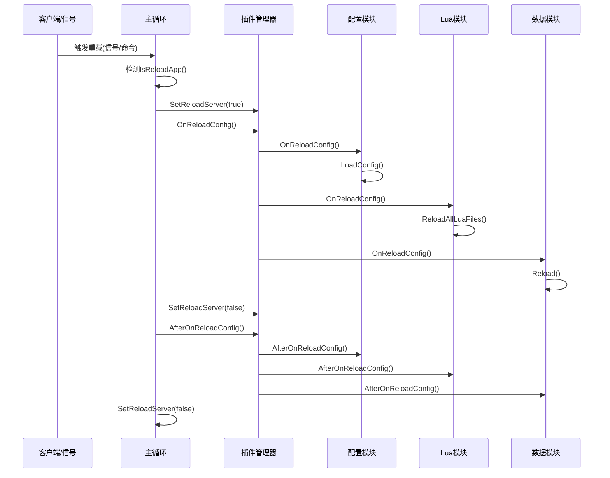

# NFShmXFrame 服务器重载配置详解

## 概述

NFShmXFrame服务器提供了强大的配置热重载功能，允许在不停服的情况下动态更新服务器配置、Lua脚本、游戏数据等。本文档详细介绍`--reload`参数的使用方法、实现原理和各种重载场景。

## 一、重载配置触发方式

### 1.1 命令行触发

```bash
# 基本重载命令
./NFPluginLoader --Server=GameServer --ID=1.11.1.1 --Reload

# 带守护进程的重载
./NFPluginLoader --Server=GameServer --ID=1.11.1.1 --Reload --Daemon
```

### 1.2 信号触发（Linux）

```bash
# 发送SIGUSR2信号触发重载
kill -USR2 <服务器进程ID>

# 或者使用killall
killall -USR2 NFGameServer1.11.1.1
```

### 1.3 HTTP接口触发

```bash
# 重载指定服务器
curl "http://127.0.0.1:6011/reload?Server=GameServer&ID=1.11.1.1"

# 重载所有服务器
curl "http://127.0.0.1:6011/reloadall"
```

### 1.4 控制台命令触发

```bash
# 在服务器控制台输入
reload

# 或者通过GM命令
curl -d '{"cmd":"reload","server_id":0}' 127.0.0.1:6105/gm
```

## 二、重载配置实现原理

### 2.1 信号处理机制

```cpp
// 信号处理函数
void HandleSignal(int signo)
{
    switch (signo)
    {
        // 重载配置信号
        case SIGUSR2:
            NFGlobalSystem::Instance()->SetReloadServer(true);
            break;
        
        // 停服信号
        case SIGUSR1:
        case SIGTERM:
            NFGlobalSystem::Instance()->SetServerStopping(true);
            break;
            
        // 强制杀死信号
        case SIGUNUSED:
            NFGlobalSystem::Instance()->SetServerKilling(true);
            break;
    }
}
```

### 2.2 主循环检测机制

```cpp
// 主循环中的重载检测
while (true)
{
    // 执行所有插件管理器的每帧逻辑
    for (auto* pPluginManager : vecPluginManager)
    {
        pPluginManager->Execute();
    }

    // 配置重载处理
    if (NFGlobalSystem::Instance()->IsReloadApp())
    {
        for (auto* pPluginManager : vecPluginManager)
        {
            // 配置重载三部曲
            pPluginManager->SetReloadServer(true);       // 设置重载标记
            pPluginManager->OnReloadConfig();            // 执行重载
            pPluginManager->SetReloadServer(false);      // 清理标记
            pPluginManager->AfterOnReloadConfig();       // 重载后处理
        }
        NFGlobalSystem::Instance()->SetReloadServer(false); // 重置全局标记
    }
}
```

### 2.3 命令行重载处理

```cpp
// 命令行重载处理
if (cmdParser.Exist("Reload"))
{
    // 调用插件管理器的重载方法
    pPluginManager->ReloadApp();
    exit(0);  // 重载命令执行后退出
}

// ReloadApp实现（Linux）
void NFCPluginManager::ReloadApp()
{
    // 检查PID文件是否存在
    if (NFFileUtility::IsFileExist(m_strPidFileName))
    {
        // 读取进程ID
        std::string content;
        NFFileUtility::ReadFileContent(m_strPidFileName, content);
        pid_t proc_id = NFCommon::strto<pid_t>(content);
        
        // 发送SIGUSR2信号触发重载
        kill(proc_id, SIGUSR2);
    }
}
```

## 三、重载配置流程详解

### 3.1 完整重载流程



### 3.2 插件管理器重载流程

```cpp
bool NFCPluginManager::OnReloadConfig()
{
    NFLogInfo(NF_LOG_DEFAULT, 0, "NFPluginManager OnReloadConfig................");

    // 1. 重新加载服务器配置
    FindModule<NFIConfigModule>()->LoadConfig();

    // 2. 通知所有插件重载配置
    for (auto itInstance = m_nPluginInstanceMap.begin(); 
         itInstance != m_nPluginInstanceMap.end(); ++itInstance)
    {
        itInstance->second->OnReloadConfig();
    }

    return true;
}

bool NFCPluginManager::AfterOnReloadConfig()
{
    NFLogInfo(NF_LOG_DEFAULT, 0, "NFPluginManager AfterOnReloadConfig................");

    // 通知所有插件执行重载后处理
    for (auto itInstance = m_nPluginInstanceMap.begin(); 
         itInstance != m_nPluginInstanceMap.end(); ++itInstance)
    {
        itInstance->second->AfterOnReloadConfig();
    }

    return true;
}
```

## 四、各类配置重载详解

### 4.1 基础配置重载

#### 4.1.1 服务器配置重载

```cpp
bool NFCConfigModule::OnReloadConfig()
{
    // 重新加载Lua配置文件
    TryAddPackagePath(m_pObjPluginManager->GetPluginPath());
    
    std::list<std::string> fileList;
    NFFileUtility::GetFiles(m_pObjPluginManager->GetPluginPath(), fileList, true, "*.lua");

    for (auto& file : fileList)
    {
        if (TryLoadScriptFile(file) == false)
        {
            NFLogError(NF_LOG_DEFAULT, 0, "Reload {} Failed!", file);
            return false;
        }
    }

    // 重新加载各类配置
    LoadPluginConfig();
    LoadServerConfig();
    LoadLogConfig();
    CheckConfig();
    
    return true;
}
```

#### 4.1.2 插件配置重载

```lua
-- Plugin.lua配置示例
LoadPlugin = {
    GameServer = {
        ServerType = NF_ST_GAME_SERVER,
        FramePlugins = {
            "NFKernelPlugin",
            "NFNetPlugin",
            "NFConfigPlugin"
        },
        ServerPlugins = {
            "NFGameServerPlugin"
        }
    }
}
```

### 4.2 Lua脚本重载

#### 4.2.1 Lua脚本重载机制

```cpp
// Lua模块重载
bool NFCLuaScriptModule::OnReloadConfig()
{
    ReloadAllLuaFiles();
    return true;
}

void NFCLuaScriptModule::ReloadAllLuaFiles()
{
    TryRunGlobalScriptFunc("NFLuaReload.ReloadAll");
}
```

#### 4.2.2 Lua热更新实现

```lua
-- NFLuaReload.lua
function NFLuaReload.ReloadAll()
    local modifyFiles = {}
    
    for file_path, value in pairs(package.loaded) do
        if type(file_path) == "string" and type(value) == "boolean" and value == true then
            if NFLuaReload.ReloadNewFile(file_path) == true then
                table.insert(modifyFiles, file_path)
            end
        end
    end
    
    LuaNFrame.Info(NFLogId.NF_LOG_DEFAULT, 0, "Reload All Modified Lua File Success")
    return modifyFiles
end

function NFLuaReload.ReloadNewFile(file_path)
    local path, err = package.searchpath(file_path, package.path)
    if path and string.find(path, "LuaScript") then
        local file_time = lfs.attributes(path, "modification")
        if file_time ~= NFLuaReload.path_to_time[path] then
            NFLuaReload.path_to_time[path] = file_time
            
            if not package.loaded[file_path] then
                require(file_path)
            else
                NFLuaReload.hotfix.hotfix_module(file_path)
            end
            
            LuaNFrame.Info(NFLogId.NF_LOG_DEFAULT, 0, "Hotfix Lua File:{} Success", file_path)
            return true
        end
    end
    
    return false
end
```

### 4.3 游戏数据重载

#### 4.3.1 描述存储重载

```cpp
bool NFCDescStoreModule::OnReloadConfig()
{
    Reload();
    return true;
}

int NFCDescStoreModule::Reload()
{
    NFLogTrace(NF_LOG_DEFAULT, 0, "--- begin -- ");
    
    for (const std::string& name : mDescStoreRegisterList)
    {
        NFIDescStore* pDescStore = mDescStoreMap[name];
        assert(pDescStore);

        NFLogInfo(NF_LOG_DEFAULT, 0, "Desc Store Begin Reload:{}", name);

        if (pDescStore->IsFileLoad())
        {
            // 文件加载模式重载
            int ret = ReLoadDescStore(pDescStore);
            CHECK_EXPR_ASSERT(ret == 0, ret, "ReLoad Desc Store Failed!");
        }
        else
        {
            // 数据库加载模式重载（协程）
            FindModule<NFICoroutineModule>()->MakeCoroutine([pDescStore, this]
            {
                int ret = ReLoadDescStore(pDescStore);
                NF_ASSERT_MSG(ret == 0, "ReLoad Desc Store Failed!");
            });
        }
    }

    // 重置重载标志
    for (auto& pair : mDescStoreMap)
    {
        pair.second->SetReLoading(false);
    }

    NFLogTrace(NF_LOG_DEFAULT, 0, "--- end -- ");
    return 0;
}
```

#### 4.3.2 文件MD5检查机制

```cpp
int NFCDescStoreModule::ReLoadDescStore(NFIDescStore* pDescStore)
{
    if (pDescStore->IsFileLoad())
    {
        std::string fileMd5;
        if (!pDescStore->GetFilePathName().empty() && 
            NFFileUtility::IsFileExist(pDescStore->GetFilePathName()))
        {
            // 检查文件MD5是否变化
            int ret = GetFileContainMD5(pDescStore->GetFilePathName(), fileMd5);
            if (ret == 0 && fileMd5 == std::string(pDescStore->GetFileMD5()))
            {
                // 文件未变化，跳过重载
                return 0;
            }
        }

        NFLogInfo(NF_LOG_DEFAULT, 0, "File {}.bin Changed, Reload.", pDescStore->GetFileName());
        
        pDescStore->SetReLoading(true);
        int ret = pDescStore->Reload(m_pResFileDB);
        CHECK_EXPR(ret == 0, ret, "Desc Store Reload table:{} error", pDescStore->GetFileName());

        pDescStore->SetLoaded(true);
        pDescStore->SetChecked(false);

        // 更新MD5
        if (!pDescStore->GetFilePathName().empty() && fileMd5.size() > 0)
        {
            pDescStore->SetMD5(fileMd5.c_str());
        }
    }
    
    return 0;
}
```

## 五、多服务器重载场景

### 5.1 单服务器重载

```bash
# 重载单个GameServer
./NFPluginLoader --Server=GameServer --ID=1.11.1.1 --Reload

# 重载单个ProxyServer
./NFPluginLoader --Server=ProxyServer --ID=1.10.1.1 --Reload
```

### 5.2 AllServer模式重载

```bash
# 重载AllServer模式的服务器
./NFPluginLoader --Server=AllServer --ID=1.1.1.1 --Reload

# 效果：重载进程中的所有服务器类型
# - ProxyServer
# - GameServer
# - LogicServer
# - WorldServer
# 等等...
```

### 5.3 AllMoreServer模式重载

```bash
# 重载AllMoreServer模式的服务器
./NFPluginLoader --Server=AllMoreServer --ID=1.1.1.1 --Reload

# 效果：重载进程中的所有服务器实例
# - ProxyServer1 (1.10.1.1)
# - ProxyServer2 (1.10.1.2)
# - GameServer1 (1.11.1.1)
# - GameServer2 (1.11.1.2)
# 等等...
```

### 5.4 集群重载

```bash
# 通过MasterServer HTTP接口重载指定服务器
curl "http://127.0.0.1:6011/reload?Server=GameServer&ID=1.11.1.1"

# 重载所有服务器
curl "http://127.0.0.1:6011/reloadall"
```

## 六、重载配置最佳实践

### 6.1 安全重载流程

```bash
# 1. 备份配置文件
cp -r ./Config ./Config.backup.$(date +%Y%m%d_%H%M%S)

# 2. 验证配置文件语法
lua -e "dofile('./Config/Plugin.lua')"
lua -e "dofile('./Config/Server.lua')"

# 3. 执行重载
./NFPluginLoader --Server=GameServer --ID=1.11.1.1 --Reload

# 4. 检查重载结果
tail -f ./logs/GameServer_1.11.1.1.log | grep -i reload
```

### 6.2 分级重载策略

```bash
# 轻量级重载：仅重载Lua脚本
curl -d '{"cmd":"hotfix_lua"}' 127.0.0.1:6105/gm

# 中等重载：重载配置和脚本
curl -d '{"cmd":"reload"}' 127.0.0.1:6105/gm

# 完全重载：重载所有配置、脚本、数据
./NFPluginLoader --Server=GameServer --ID=1.11.1.1 --Reload
```

### 6.3 批量重载脚本

```bash
#!/bin/bash
# reload_all_servers.sh

SERVERS=(
    "ProxyServer:1.10.1.1"
    "GameServer:1.11.1.1"
    "LogicServer:1.12.1.1"
    "WorldServer:1.13.1.1"
)

for server_info in "${SERVERS[@]}"; do
    IFS=':' read -r server_name server_id <<< "$server_info"
    echo "Reloading $server_name ($server_id)..."
    
    ./NFPluginLoader --Server=$server_name --ID=$server_id --Reload
    
    if [ $? -eq 0 ]; then
        echo "✓ $server_name ($server_id) reloaded successfully"
    else
        echo "✗ $server_name ($server_id) reload failed"
    fi
    
    sleep 1
done
```

## 七、重载配置监控

### 7.1 重载状态检查

```bash
# 检查重载日志
grep -i "OnReloadConfig" ./logs/GameServer_1.11.1.1.log

# 检查Lua重载日志
grep -i "Hotfix Lua File" ./logs/GameServer_1.11.1.1.log

# 检查数据重载日志
grep -i "Desc Store.*Reload" ./logs/GameServer_1.11.1.1.log
```

### 7.2 重载性能监控

```cpp
// 重载性能统计
class ReloadProfiler
{
public:
    void StartReload(const std::string& type)
    {
        m_startTime = NFGetTimeMS();
        m_reloadType = type;
    }
    
    void EndReload()
    {
        uint64_t elapsed = NFGetTimeMS() - m_startTime;
        NFLogInfo(NF_LOG_DEFAULT, 0, "Reload {} completed in {}ms", m_reloadType, elapsed);
        
        // 记录重载统计
        m_reloadStats[m_reloadType].push_back(elapsed);
    }
    
private:
    uint64_t m_startTime;
    std::string m_reloadType;
    std::map<std::string, std::vector<uint64_t>> m_reloadStats;
};
```

## 八、常见问题和解决方案

### 8.1 重载失败处理

**问题1：配置文件语法错误**
```bash
# 症状：重载后服务器异常
# 解决：验证配置文件语法
lua -e "dofile('./Config/Plugin.lua')"

# 恢复备份配置
cp -r ./Config.backup.20231201_143022/* ./Config/
./NFPluginLoader --Server=GameServer --ID=1.11.1.1 --Reload
```

**问题2：Lua脚本热更失败**
```lua
-- 症状：Lua热更后功能异常
-- 解决：检查Lua模块依赖关系
function CheckLuaDependencies()
    for module_name, _ in pairs(package.loaded) do
        if string.find(module_name, "YourGame") then
            print("Loaded module:", module_name)
        end
    end
end
```

**问题3：数据重载不生效**
```cpp
// 症状：游戏数据未更新
// 解决：检查文件MD5和时间戳
bool CheckDataFileStatus(const std::string& fileName)
{
    std::string currentMD5 = NFMD5::md5file(fileName);
    time_t modifyTime = NFFileUtility::GetFileModificationTime(fileName);
    
    NFLogInfo(NF_LOG_DEFAULT, 0, "File: {}, MD5: {}, Time: {}", 
             fileName, currentMD5, modifyTime);
    return true;
}
```

### 8.2 性能优化建议

**1. 分批重载**
```cpp
// 避免同时重载大量数据
void BatchReload(const std::vector<std::string>& files)
{
    const int BATCH_SIZE = 10;
    for (int i = 0; i < files.size(); i += BATCH_SIZE)
    {
        // 重载一批文件
        for (int j = i; j < std::min(i + BATCH_SIZE, (int)files.size()); j++)
        {
            ReloadFile(files[j]);
        }
        
        // 短暂休眠，避免CPU占用过高
        NFSLEEP(10);
    }
}
```

**2. 增量重载**
```cpp
// 只重载变化的文件
void IncrementalReload()
{
    std::vector<std::string> changedFiles;
    
    for (const auto& file : m_watchedFiles)
    {
        if (IsFileChanged(file))
        {
            changedFiles.push_back(file);
        }
    }
    
    if (!changedFiles.empty())
    {
        BatchReload(changedFiles);
    }
}
```

## 九、总结

NFShmXFrame的配置重载功能提供了强大而灵活的热更新能力：

### 9.1 核心优势

1. **多触发方式**：支持命令行、信号、HTTP、控制台等多种触发方式
2. **全面覆盖**：支持服务器配置、Lua脚本、游戏数据等全方位重载
3. **安全可靠**：通过MD5校验、增量更新等机制确保重载安全性
4. **性能优化**：支持分批重载、协程处理等性能优化策略
5. **易于监控**：提供详细的重载日志和状态检查机制

### 9.2 使用建议

1. **生产环境**：建议使用信号或HTTP接口触发重载，避免直接命令行操作
2. **测试环境**：可以使用命令行重载，便于快速验证配置变更
3. **集群环境**：通过MasterServer统一管理集群重载，确保一致性
4. **监控告警**：建立重载监控体系，及时发现和处理重载异常

通过合理使用重载配置功能，可以显著提高服务器运维效率，实现真正的热更新和零停机维护。 